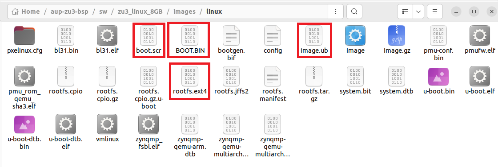

# Building PetaLinux for AUP-ZU3 (ELEC3607)

This document provides step-by-step instructions to build a **PetaLinux image** for the **AUP-ZU3** development board used in the **ELEC3607 Embedded Systems Design** course.

---

## 📦 PetaLinux Download

Download the latest PetaLinux tools (version **2024.1** or newer) from AMD’s official website:

👉 [https://www.xilinx.com/support/download/index.html/content/xilinx/en/downloadNav/embedded-design-tools/2024-1.html](https://www.xilinx.com/support/download/index.html/content/xilinx/en/downloadNav/embedded-design-tools/2024-1.html)

---

## 🧰 Requirements

- **AUP-ZU3 Development Board**
- **Vivado 2024.1 or 2024.2**
- **Vitis 2024.1 or 2024.2**
- **PetaLinux 2024.1 or 2024.2**
- Linux host system (e.g. Ubuntu 20.04 or later)

---

## ⚙️ Build Steps

### 1. Create PetaLinux Project

To create a new PetaLinux project from the BSP file:

```bash
cd ~/aup-zu3-bsp/sw
petalinux-create project -n zu3_linux -s petalinux-8GB.bsp
```

**Key output:**
```
[INFO] Create project: zu3_linux
[INFO] New project successfully created in /home/aupzu3/aup-zu3-bsp/sw/zu3_linux
```

---

### 2. Build the Project

After creating the project, navigate into the project directory and build it:

```bash
cd zu3_linux
petalinux-build
```

**Key output:**
```
[INFO] Building project
[INFO] Getting Platform info from HW file
[INFO] Generating Kconfig for project
[INFO] bitbake petalinux-image-minimal
NOTE: Tasks Summary: All succeeded.
[INFO] Successfully built project
```

> ⚠️ Possible warnings:
> - `XSCT has been deprecated` — safe to ignore.
> - `Failed to copy built images to tftp dir` — non-critical unless using TFTP boot.

---

### 3. Generate BOOT.BIN

Once the build completes, generate the boot image with:

```bash
petalinux-package boot --u-boot --fpga --force
```

**Key output:**
```
[INFO] File in BOOT BIN: zynqmp_fsbl.elf
[INFO] File in BOOT BIN: pmufw.elf
[INFO] File in BOOT BIN: hw_8GB.bit
[INFO] File in BOOT BIN: bl31.elf
[INFO] File in BOOT BIN: system.dtb
[INFO] File in BOOT BIN: u-boot.elf
[INFO] Generating zynqmp binary package BOOT.BIN...
[INFO] Binary is ready.
[INFO] Successfully Generated BIN File
```

The generated files will be located in:

```
/home/aupzu3/aup-zu3-bsp/sw/zu3_linux/images/linux/
```

---

## 📁 Output Files

| File | Description |
|------|--------------|
| `BOOT.BIN` | Boot image containing FSBL, PMUFW, bitstream, ATF, DTB, and U-Boot |
| `image.ub` | Combined Linux kernel and device tree |
| `rootfs.tar.gz` | Minimal root filesystem |
| `system.dtb` | Device tree blob |

---

## 🖼️ Directory Overview

Below is an example build flow illustration (optional):


---

## ✅ Summary

After completing these steps, you will have successfully built the **PetaLinux image** and **BOOT.BIN** for the AUP-ZU3 board.  
These files can now be used for SD card boot or JTAG-based Linux boot testing on the ELEC3607 development setup.

---

**Author:** ELEC3607 Teaching Team  
**Board:** AUP-ZU3 (Zynq UltraScale+ MPSoC)  
**Tool Version:** Vitis/Vivado/PetaLinux 2024.1–2024.2


