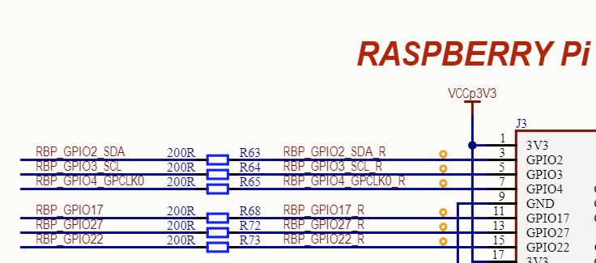
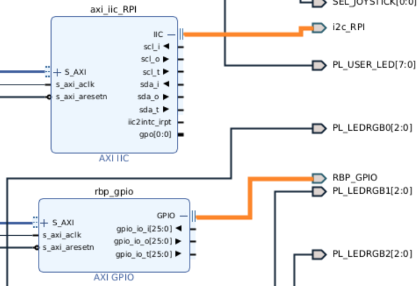

# Export XSA from Vivado for AUP-ZU3 (ELEC3607)

This document provides step-by-step instructions to build a XSA file for the **AUP-ZU3** development board used in the **ELEC3607 Embedded Systems Design** course.

---

## Vitis Download
Download the latest Vitis tools (version **2024.1** ) from [AMD’s official website](https://www.xilinx.com/support/download/index.html/content/xilinx/en/downloadNav/vitis/2024-1.html)

---

## AUP-ZU3-BSP Download
Download the BSP tools of AUP-ZU3 from [RealDigital github website](https://github.com/RealDigitalOrg/aup-zu3-bsp)

---

## Requirements
- **Vivado 2024.1**
- Linux host system (e.g. Ubuntu 22.04.3)

---

## Build Steps

### 1. Create a Vivado Project
First Using "git clone", install "https://github.com/Digilent/vivado-library.git" repository in "~/Src"

To create a new vivado project from the tcl file:

```bash
cd ~/aup-zu3-bsp/hw
vivado -mode batch -source hw-8GB.tcl
vivado hw/hw.xpr
```

### 2. Add a IIC interface for RPI pin


The PCB diagram above tells us that GPIO2 and GPIO3 represent SDA and SCL on the RPi respectively. Initially, all pins of the RPi are controlled by GPIO. We will separate SDA and SCL and control them through an IIC interface.

First, change the mpsoc.xdc in Constraints:
```
## Rasbery PI Headers

set_property PACKAGE_PIN AF10 [get_ports {RBP_GPIO_tri_io[0]}]
set_property PACKAGE_PIN AG10 [get_ports {RBP_GPIO_tri_io[1]}]
set_property PACKAGE_PIN AC12 [get_ports {RBP_GPIO_tri_io[2]}]
set_property PACKAGE_PIN AD12 [get_ports {RBP_GPIO_tri_io[3]}]
set_property PACKAGE_PIN AE12 [get_ports {RBP_GPIO_tri_io[4]}]
set_property PACKAGE_PIN AE10 [get_ports {RBP_GPIO_tri_io[5]}]
set_property PACKAGE_PIN AB11 [get_ports {RBP_GPIO_tri_io[6]}]
set_property PACKAGE_PIN AD11 [get_ports {RBP_GPIO_tri_io[7]}]
set_property PACKAGE_PIN AG11 [get_ports {RBP_GPIO_tri_io[8]}]
set_property PACKAGE_PIN AH11 [get_ports {RBP_GPIO_tri_io[9]}]
set_property PACKAGE_PIN AH12 [get_ports {RBP_GPIO_tri_io[10]}]
set_property PACKAGE_PIN AH10 [get_ports {RBP_GPIO_tri_io[11]}]
set_property PACKAGE_PIN AD10 [get_ports {RBP_GPIO_tri_io[12]}]
set_property PACKAGE_PIN AA11 [get_ports {RBP_GPIO_tri_io[13]}]
set_property PACKAGE_PIN AE15 [get_ports {RBP_GPIO_tri_io[14]}]
set_property PACKAGE_PIN AF13 [get_ports {RBP_GPIO_tri_io[15]}]
set_property PACKAGE_PIN AB10 [get_ports {RBP_GPIO_tri_io[16]}]
set_property PACKAGE_PIN AG14 [get_ports {RBP_GPIO_tri_io[17]}]
set_property PACKAGE_PIN AC11 [get_ports {RBP_GPIO_tri_io[18]}]
set_property PACKAGE_PIN AB9 [get_ports {RBP_GPIO_tri_io[19]}]
set_property PACKAGE_PIN AA10 [get_ports {RBP_GPIO_tri_io[20]}]
set_property PACKAGE_PIN Y9 [get_ports {RBP_GPIO_tri_io[21]}]
set_property PACKAGE_PIN AH13 [get_ports {RBP_GPIO_tri_io[22]}]
set_property PACKAGE_PIN AG13 [get_ports {RBP_GPIO_tri_io[23]}]
set_property PACKAGE_PIN AF12 [get_ports {RBP_GPIO_tri_io[24]}]
set_property PACKAGE_PIN AF11 [get_ports {RBP_GPIO_tri_io[25]}]
set_property PACKAGE_PIN AA8 [get_ports {RBP_GPIO_tri_io[26]}]
set_property PACKAGE_PIN AH14 [get_ports {RBP_GPIO_tri_io[27]}]
set_property IOSTANDARD LVCMOS33 [get_ports RBP_GPIO_tri_io*]
```
change to
```
## IIC control RPi
set_property PACKAGE_PIN AC12 [get_ports i2c_RPI_sda_io]
set_property PACKAGE_PIN AD12 [get_ports i2c_RPI_scl_io]
set_property IOSTANDARD LVCMOS33 [get_ports i2c_RPI_*]

## Rasbery PI Headers
set_property PACKAGE_PIN AF10 [get_ports {RBP_GPIO_tri_io[0]}]
set_property PACKAGE_PIN AG10 [get_ports {RBP_GPIO_tri_io[1]}]
set_property PACKAGE_PIN AE12 [get_ports {RBP_GPIO_tri_io[2]}]
set_property PACKAGE_PIN AE10 [get_ports {RBP_GPIO_tri_io[3]}]
set_property PACKAGE_PIN AB11 [get_ports {RBP_GPIO_tri_io[4]}]
set_property PACKAGE_PIN AD11 [get_ports {RBP_GPIO_tri_io[5]}]
set_property PACKAGE_PIN AG11 [get_ports {RBP_GPIO_tri_io[6]}]
set_property PACKAGE_PIN AH11 [get_ports {RBP_GPIO_tri_io[7]}]
set_property PACKAGE_PIN AH12 [get_ports {RBP_GPIO_tri_io[8]}]
set_property PACKAGE_PIN AH10 [get_ports {RBP_GPIO_tri_io[9]}]
set_property PACKAGE_PIN AD10 [get_ports {RBP_GPIO_tri_io[10]}]
set_property PACKAGE_PIN AA11 [get_ports {RBP_GPIO_tri_io[11]}]
set_property PACKAGE_PIN AE15 [get_ports {RBP_GPIO_tri_io[12]}]
set_property PACKAGE_PIN AF13 [get_ports {RBP_GPIO_tri_io[13]}]
set_property PACKAGE_PIN AB10 [get_ports {RBP_GPIO_tri_io[14]}]
set_property PACKAGE_PIN AG14 [get_ports {RBP_GPIO_tri_io[15]}]
set_property PACKAGE_PIN AC11 [get_ports {RBP_GPIO_tri_io[16]}]
set_property PACKAGE_PIN AB9 [get_ports {RBP_GPIO_tri_io[17]}]
set_property PACKAGE_PIN AA10 [get_ports {RBP_GPIO_tri_io[18]}]
set_property PACKAGE_PIN Y9 [get_ports {RBP_GPIO_tri_io[19]}]
set_property PACKAGE_PIN AH13 [get_ports {RBP_GPIO_tri_io[20]}]
set_property PACKAGE_PIN AG13 [get_ports {RBP_GPIO_tri_io[21]}]
set_property PACKAGE_PIN AF12 [get_ports {RBP_GPIO_tri_io[22]}]
set_property PACKAGE_PIN AF11 [get_ports {RBP_GPIO_tri_io[23]}]
set_property PACKAGE_PIN AA8 [get_ports {RBP_GPIO_tri_io[24]}]
set_property PACKAGE_PIN AH14 [get_ports {RBP_GPIO_tri_io[25]}]
set_property IOSTANDARD LVCMOS33 [get_ports RBP_GPIO_tri_io*]
```

Then open Block Design and add an **axi_iic_RPI** module and change the interface of the **rbp_gpio** module from [27:0] to [25:0].


