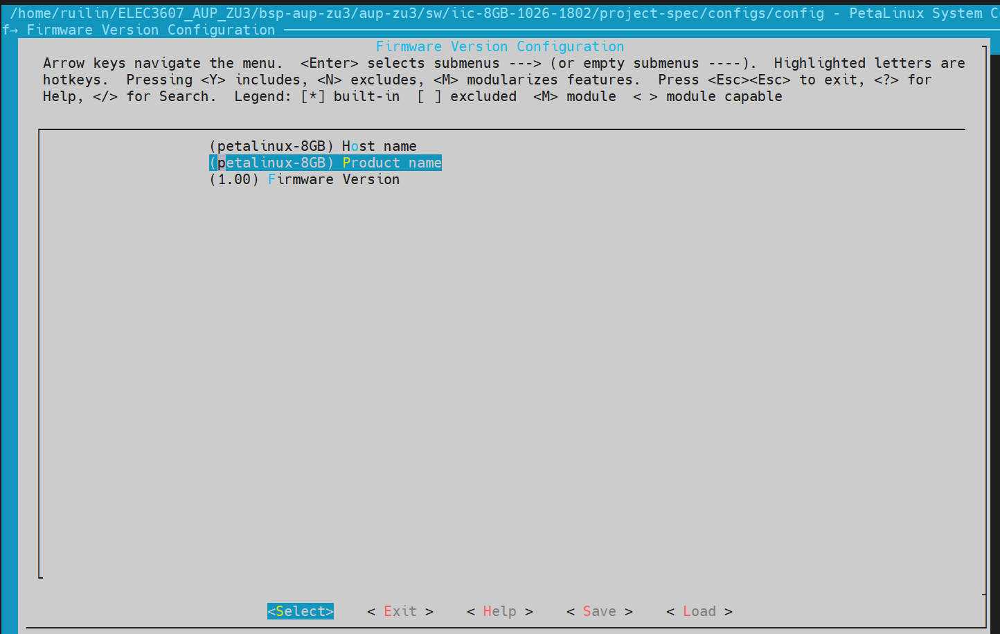
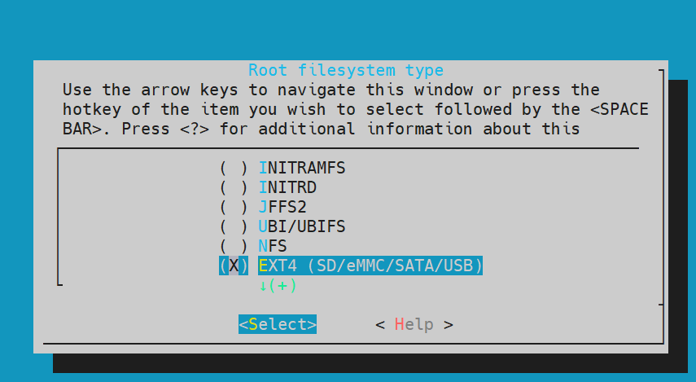
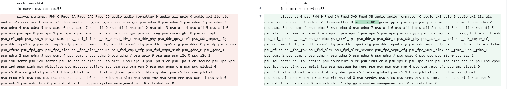
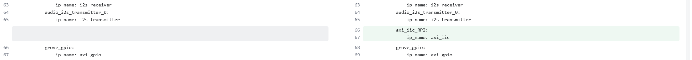
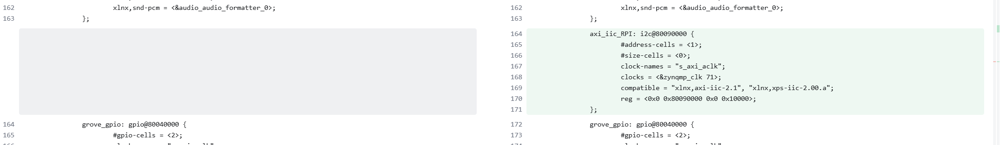
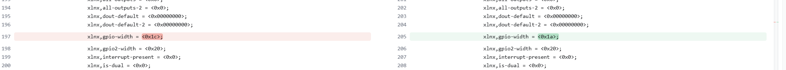
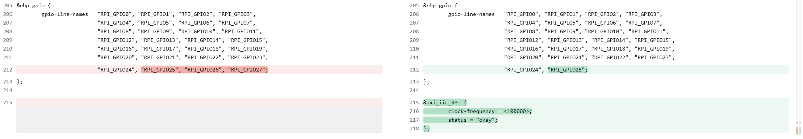
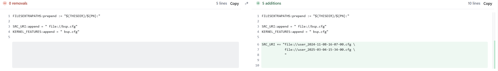

# Generate custom BSP (ELEC3607)

## Pre-bulit our petalinux project via our sxa file
We now have iic-8GB.xsa from vivado and petalinux-8GB.bsp from the official website. Our next step is to build two petalinux projects and compare the differences between the two and modify our custom iic-8GB.xsa to perfectly match the official petalinux-8GB.bsp.
### Custom xsa
First we create a petalinux project via our xsa:
```
petalinux-create project --template zynqMP --name iic-8GB-1026-1802
cd iic-8GB-1026-1802
petalinux-config --get-hw-description=/your_path/iic-8GB.xsa
```
Select Exit since we don't know the differences yet.

You also need to generate a device tree:
```
petalinux-config -c device-tree
```
### Official BSP
Then we create a petalinux project via official petalinux-8GB.bsp:
```
cd ..
petalinux-create project -n original-1026-1826 -s petalinux-8GB.bsp
cd original-1026-1826
petalinux-config
```
Select Exit since we don't know the differences yet.

### Compare and get difference

We attach a **compare.sh** to compare every difference of these two project:
```
cd ..
bash compare.sh original-1026-1826 iic-8GB-1026-1802
```

The full output file is in **project_spec_full_diff_20251026_195230.txt**. After comparison and analysis, we removed a series of intermediate files and folders and selected the most noteworthy differences.

#### Project core configuration
```
- A: original-1026-1826/project-spec/configs/config
  B: iic-8GB-1026-1802/project-spec/configs/config
```
For the above differences, we can make the following changes:
```
cd iic-8GB-1026-1802
petalinux-config
```


Go to **Image Packaging Configuration-Root filesystem type**, change **Host name** and **Product name** to **petalinux-8GB**.
<p align="center">
  
</p>

Go to **Firmware Version Configuration**, select EXT4.

<p align="center">
  
</p>

Save and exit.

In the Project_core_configuration folder, we attached 3 config files. We modified the Root filesystem and username above. Now iic-8GB-1026-1802-new-config is almost identical to original-1026-1826-config.

#### Device Tree Related

```
- A: original-1026-1826/components/plnx_workspace/device-tree/device-tree/device-tree.mss
  B: iic-8GB-1026-1802/components/plnx_workspace/device-tree/device-tree/device-tree.mss
- A: original-1026-1826/components/plnx_workspace/device-tree/device-tree/hardware_description.xsa
  B: iic-8GB-1026-1802/components/plnx_workspace/device-tree/device-tree/hardware_description.xsa
- A: original-1026-1826/components/plnx_workspace/device-tree/device-tree/pcw.dtsi
  B: iic-8GB-1026-1802/components/plnx_workspace/device-tree/device-tree/pcw.dtsi
- A: original-1026-1826/components/plnx_workspace/device-tree/device-tree/system-conf.dtsi
  B: iic-8GB-1026-1802/components/plnx_workspace/device-tree/device-tree/system-conf.dtsi
- A: original-1026-1826/components/plnx_workspace/device-tree/device-tree/system-top.dts
  B: iic-8GB-1026-1802/components/plnx_workspace/device-tree/device-tree/system-top.dts
- A: original-1026-1826/components/plnx_workspace/device-tree/device-tree/pl.dtsi
  B: iic-8GB-1026-1802/components/plnx_workspace/device-tree/device-tree/pl.dtsi
- A: original-1026-1826/project-spec/configs/plnx_syshw_data
  B: iic-8GB-1026-1802/project-spec/configs/plnx_syshw_data
  
- A: original-1026-1826/project-spec/meta-user/recipes-bsp/device-tree/files/system-user.dtsi
  B: iic-8GB-1026-1802/project-spec/meta-user/recipes-bsp/device-tree/files/system-user.dtsi
```
Previously, we modified the two pins originally controlled by GPIO to be used for IIC interface. **/components/plnx_workspace/device-tree/device-tree/pl.dtsi** and **/project-spec/configs/plnx_syshw_data** are automatically generated by the hardware description. We can compare them to get our modification traces.

For plnx_syshw_data:
<p align="center">
  
</p>
<p align="center">
  
</p>

For pl.dtsi:
<p align="center">
  
</p>
<p align="center">
  
</p>
We can see that we successfully added an IIC interface to replace the two RPi GPIO pins.

It's important to note that the file **project-spec/meta-user/recipes-bsp/device-tree/files/system-user.dtsi** is not modified by any PetaLinux tools. We must open a text editor to make the changes.

First, we copy all the contents of system-user.dtsi in original to system-user.dtsi in iic, and make the following changes at the end:
<p align="center">
  
</p>


#### Kernel Customization and Configuration


```
- A: original-1026-1826/project-spec/meta-user/recipes-kernel/linux/linux-xlnx_%.bbappend
  B: iic-8GB-1026-1802/project-spec/meta-user/recipes-kernel/linux/linux-xlnx_%.bbappend

Files/Folders only in A (original-1026-1826):
/project-spec/meta-user/recipes-kernel/linux/linux-xlnx: user_2024-11-08-16-07-00.cfg
/project-spec/meta-user/recipes-kernel/linux/linux-xlnx: user_2025-03-04-15-34-00.cfg
```

Run
```
cd iic-8GB-1026-1802
petalinux-config -c kernel
```
First go to **Device Drivers-I2C support-I2C Hardware Bus support** to ensure **Cadence I2C Controller, Xilinx I2C Controller** are enabled.

Compare linux-xlnx_%.bbappend in original folder and iic folder:
<p align="center">
  
</p>

The official original customized two user.cfg files. We need to copy them to the corresponding folders of iic and modify linux-xlnx_%.bbappend to include them.


### Project building and BSP Packaging
Run
```
petalinux-config -c rootfs
```
Use the instructions in the next section to customize the custom library and generate a complete project.

Run
```
cd iic-8GB-1026-1802
petalinux-build
cd ..
petalinux-package bsp -p iic-8GB-1026-1802 --output iic-8GB.BSP
cd iic-8GB-1026-1802
petalinux-package boot --u-boot --fpga --force
```