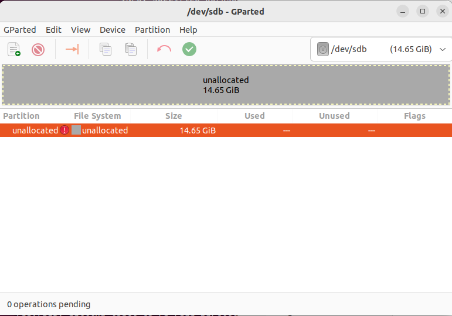
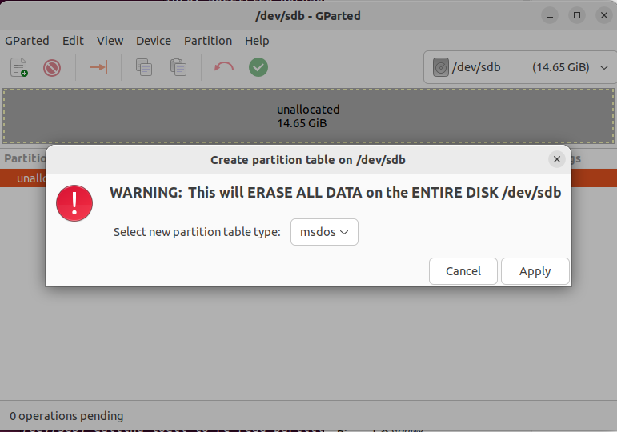
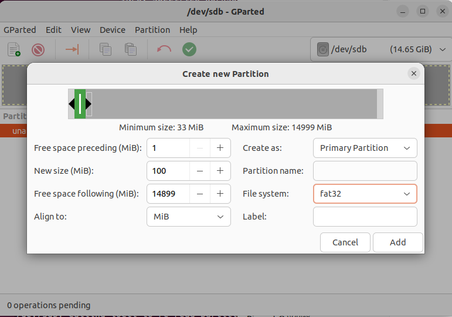
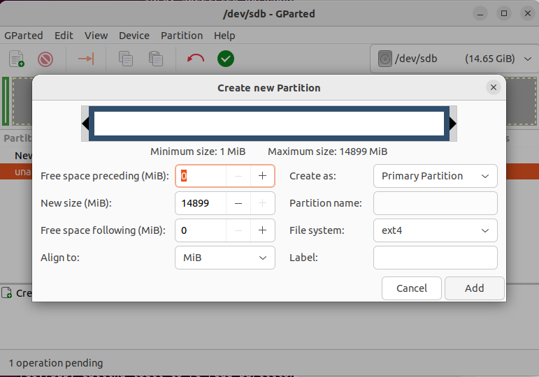
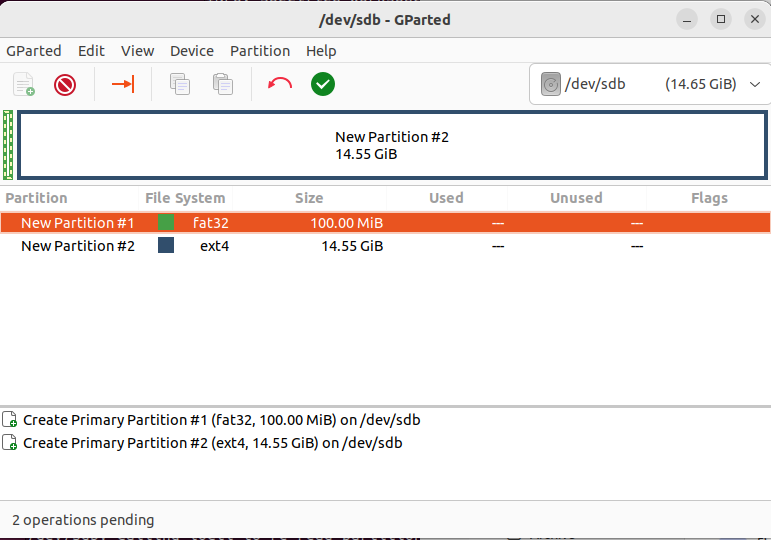

# Programming the micro-SD Card for AUP-ZU3 (ELEC3607)

This guide describes how to program a micro-SD card to boot Linux on the **AUP-ZU3** board.  
Using a 16 GB or larger micro-SD card is recommended.

---


## 1. Verify the SD Card Device

Use `lsblk` to confirm the device and partitions:

```bash
lsblk
```

Example output:

```
sdb           8:16   1  14.6G  0 disk
├─sdb1        8:17   1   130M  0 part
└─sdb2        8:18   1  14.5G  0 part
```

Unmount any automatically mounted partitions:

```bash
sudo umount /dev/sdb1
sudo umount /dev/sdb2
```

If needed, wipe old signatures:

```bash
sudo wipefs -a /dev/sdb
```

---

## 2. Partition the micro-SD Card

To boot Linux from a micro-SD card, two partitions are required:

- **Partition 1**: FAT16 or FAT32, at least 100 MB (for boot files)
- **Partition 2**: ext4, occupies the remaining space (for root filesystem)

The Linux `gparted` utility is a convenient tool for this step.

Install and start `gparted`:

```bash
sudo apt install gparted -y
sudo gparted
```

In GParted:
1. Select the SD card device (e.g. `/dev/sdb`).

2. Go to **Device → Create Partition Table → msdos → Apply**.

3. Create a new partition:
   - Type: **Primary**
   - File system: **FAT32**
   - Size: **100 MB or larger**

4. Create a second partition using the remaining space:
   - Type: **Primary**
   - File system: **ext4**

5. Click the **✓ (Apply)** button to confirm changes.



---

## 3. Mount the Boot Partition

Create a mount point and mount the first partition:

```bash
sudo mkdir -p /mnt/boot
sudo mount /dev/sdb1 /mnt/boot
```

---

## 4. Copy Boot Files

Copy the following files from the PetaLinux build output to the first partition:

```bash
sudo cp /your_path/BOOT.BIN /mnt/boot/
sudo cp /your_path/boot.scr /mnt/boot/
sudo cp /your_path/image.ub /mnt/boot/
```

Verify the files:

```bash
ls /mnt/boot
```

Expected output:

```
BOOT.BIN  boot.scr  image.ub
```

---

## 5. Write the Root Filesystem

Use the `dd` utility to write the ext4 root filesystem to the second partition.

```bash
sudo dd if=/your_path/rootfs.ext4 of=/dev/sdb2
```

Example output:

```
345280+0 records in
345280+0 records out
176783360 bytes (177 MB, 169 MiB) copied, 28.15 s, 6.3 MB/s
```

---

## 6. Check and Resize the Filesystem

Run a filesystem check:

```bash
sudo e2fsck -f /dev/sdb2
```

Then resize it to fill the partition:

```bash
sudo resize2fs /dev/sdb2
```

Expected output:

```
resize2fs 1.46.5 (30-Dec-2021)
Resizing the filesystem on /dev/sdb2 to 15256576 (1k) blocks.
The filesystem on /dev/sdb2 is now 15256576 (1k) blocks long.
```

---

## 7. Verify the SD Card Contents

Check the partition file systems:

```bash
lsblk -f
```

Example output:

```
sdb
├─sdb1 vfat   FAT32       7DB8-584D  /mnt/boot
└─sdb2 ext4   1.0         9c2093d5-cb36-470c-96d0-8e938925e794
```

You can also mount both partitions to verify:
```bash
ls /mnt/boot
```

Expected files:

```
BOOT.BIN  boot.scr  image.ub
```
Or
```bash
sudo mkdir -p /mnt/rootfs
sudo mount /dev/sdb2 /mnt/rootfs
ls /mnt/rootfs
```

Expected directories:

```
bin  boot  dev  etc  home  lib  media  mnt  proc  run  sbin  srv  sys  tmp  usr  var
```

Finally, unmount and eject the SD card:

```bash
sudo umount /mnt/boot
sudo umount /mnt/rootfs
sudo eject /dev/sdb
```

