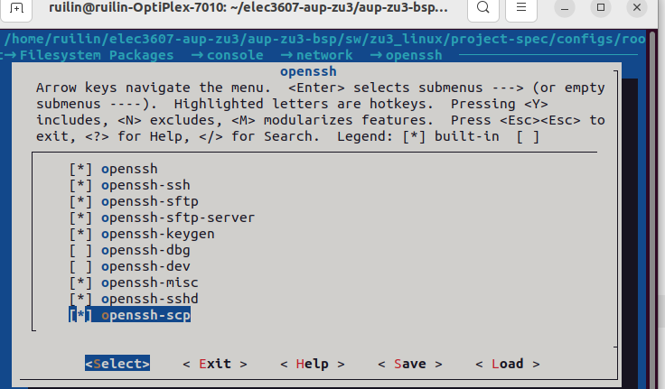
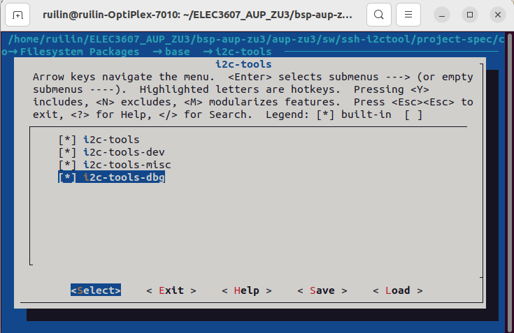
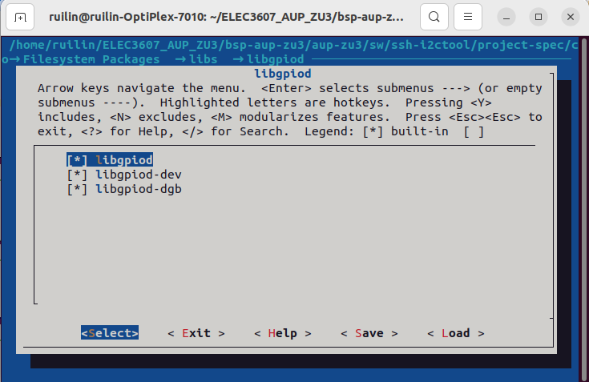
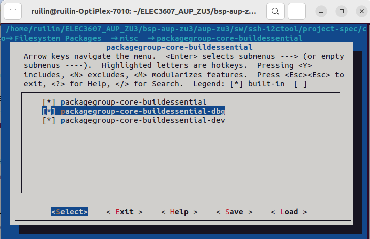

# Building PetaLinux for AUP-ZU3 (ELEC3607)

This document provides step-by-step instructions to build a **PetaLinux image** for the **AUP-ZU3** development board used in the **ELEC3607 Embedded Systems Design** course.

---

## PetaLinux Download
Download the latest PetaLinux tools (version **2024.1** ) from [AMD’s official website](https://www.xilinx.com/support/download/index.html/content/xilinx/en/downloadNav/embedded-design-tools/2024-1.html)

---

## AUP-ZU3-BSP Download
Download the BSP tools of AUP-ZU3 from [RealDigital github website](https://github.com/RealDigitalOrg/aup-zu3-bsp)

---

## Requirements
- **PetaLinux 2024.1**
- Linux host system (e.g. Ubuntu 22.04.3)

---

## Build Steps

### 1. Create PetaLinux Project

To create a new PetaLinux project from the BSP file:

```bash
cd ~/aup-zu3-bsp/sw
petalinux-create project -n zu3_linux -s petalinux-8GB.bsp
```

**Key output:**
```
[INFO] Create project: zu3_linux
[INFO] New project successfully created in /home/aupzu3/aup-zu3-bsp/sw/zu3_linux
```

**Custom settings:**
```bash
cd zu3_linux
petalinux-config -c rootfs
```
1.Go to **Filesystems Packages-console-network-openssh**, select 



2.Go to **Filesystems Packages-base-i2c-tools**



3.Go to **Filesystems Packages-libs-libgpiod**, select 



4.Go to **Filesystems Packages-misc-packagegroup-core-buildessential**, select 



5.Add 
```
CONFIG_libfftwf
CONFIG_sox
CONFIG_libgpiod-tools
```
to **project-spec/meta-user/conf/user-rootfsconfig**.

Then go to User packages, select 


---

### 2. Build the Project

After creating the project, navigate into the project directory and build it:

```bash

petalinux-build
```

**Key output:**
```
[INFO] Building project
[INFO] Getting Platform info from HW file
[INFO] Generating Kconfig for project
[INFO] bitbake petalinux-image-minimal
NOTE: Tasks Summary: All succeeded.
[INFO] Successfully built project
```

---

### 3. Generate BOOT.BIN

Once the build completes, generate the boot image with:

```bash
petalinux-package boot --u-boot --fpga --force
```

**Key output:**
```
[INFO] File in BOOT BIN: zynqmp_fsbl.elf
[INFO] File in BOOT BIN: pmufw.elf
[INFO] File in BOOT BIN: hw_8GB.bit
[INFO] File in BOOT BIN: bl31.elf
[INFO] File in BOOT BIN: system.dtb
[INFO] File in BOOT BIN: u-boot.elf
[INFO] Generating zynqmp binary package BOOT.BIN...
[INFO] Binary is ready.
[INFO] Successfully Generated BIN File
```

The generated files will be located in:

```
aup-zu3-bsp/sw/zu3_linux/images/linux/
```

---

##  Output Files

Only the following four files are required for booting the AUP-ZU3 board:

| File | Description |
|------|--------------|
| `BOOT.BIN` | Boot image containing FSBL, PMUFW, bitstream, ATF, DTB, and U-Boot |
| `boot.scr` | U-Boot boot script |
| `image.ub` | Combined Linux kernel and device tree |
| `rootfs.ext4` | Root filesystem image |

Below is an example of output files :


---

