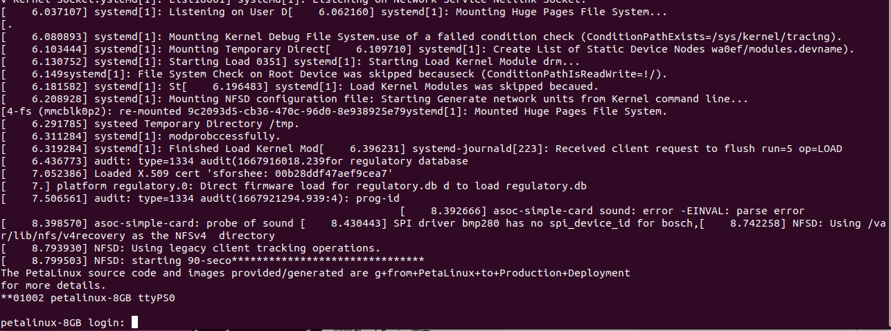

# Booting AUP-ZU3 from micro-SD Card (Serial Console)

This document explains how to boot the **AUP-ZU3** development board from a pre-programmed micro-SD card and access the Linux system through a serial terminal on your Ubuntu host.

---

## 1. Preparation

Before powering on the board, ensure that:

1. The **micro-SD card** (prepared earlier with `BOOT.BIN`, `boot.scr`, `image.ub`, and `rootfs.ext4`) is inserted into the board’s SD slot.  
2. The **JTAG / SD switch** on the board is set to **SD** mode.  
3. Connect the PROG-UART interface of the AUP-ZU3 board to the host PC via a USB-C cable.

If you see the **DONE** LED light turn on after powering on the board, congratulations — you have successfully booted the board!


---

## 2. Load FTDI Serial Drivers on Host (Ubuntu)

Check whether the FTDI driver module is already loaded:

```bash
lsmod | grep ftdi_sio
```

If there is no output, load the required kernel modules manually:

```bash
sudo modprobe ftdi_sio
sudo modprobe usbserial
```

Verify that the modules are loaded:

```bash
lsmod | grep ftdi_sio
```

Expected output:
```
ftdi_sio               69632  0
usbserial              69632  1 ftdi_sio
```

---

## 3. Check USB Connection

List all connected USB devices to confirm detection of the FTDI dual-UART interface:

```bash
lsusb
```

Example output:
```
Bus 001 Device 020: ID 0403:6010 Future Technology Devices International, Ltd FT2232C/D/H Dual UART/FIFO IC
```

List the detected serial ports:

```bash
ls /dev/ttyUSB*
```

Expected output:
```
/dev/ttyUSB0  /dev/ttyUSB1
```


---

## 4. Open Serial Terminal

Install the `screen` terminal utility (if not already installed):

```bash
sudo apt install screen -y
```
In the AUP-ZU3 and most Zynq / Zynq UltraScale+ MPSoC-based development boards, the UART console typically operates at a default baud rate of 115200.
Open a serial console session (use ttyUSB1, which is usually connected to the main Linux UART output):

```bash
sudo screen /dev/ttyUSB1 115200
```

---

## 5. Power On and Boot Linux

1. With `screen` running, press the **POR** (Power-On Reset) button on the AUP-ZU3 board.  
2. The boot messages from PetaLinux will appear in the terminal.  
3. Wait until the login prompt appears.

Example output:


---

## 6. Login to Petalinux

Use the default login credentials:

- **Username:** `petalinux` (you can also use any other username you like) 
- On the first login, the system will prompt you to create a **new password** for future logins.

Once completed, you will have access to the Petalinux shell on the AUP-ZU3 board.


## Important components on the AUP-ZU3 (marked in red):

